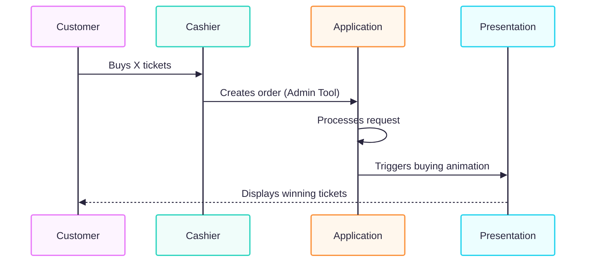

# Tombola Organizer
Tool to organize a tombola for local events. The Tool is not ment as a webshop, but rather for showcasting the boughed tickets and prices to the crowd. It includes calculating country specific regulations, creating tickets, linking tickets to prices, and showcasting buyed tickets and prices on an extra TV.

## Tool Requirements
- Additional TV for showcasting (Optional, but sad without)
- Java

## How does the tool work?

### Buying tickets
The tool is not built as a webshop! The cashier first needs to check the payment of the customer. If he approves, the ticket will be created and a display animation is shown on the TV.

### Download
TODO: download exe
