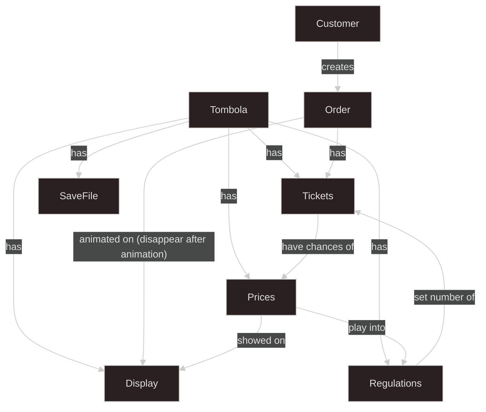
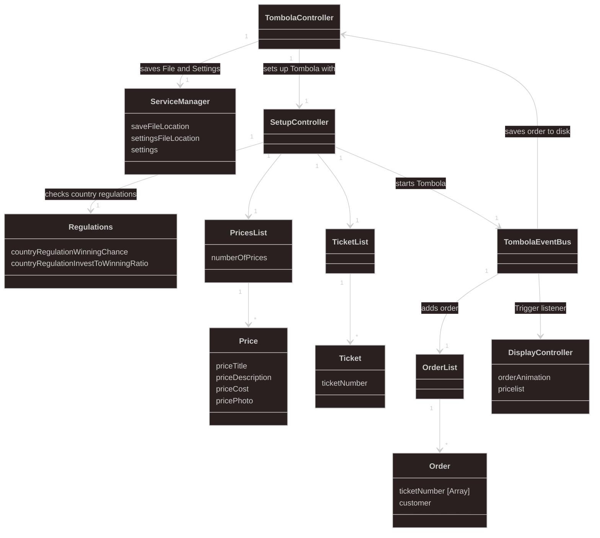
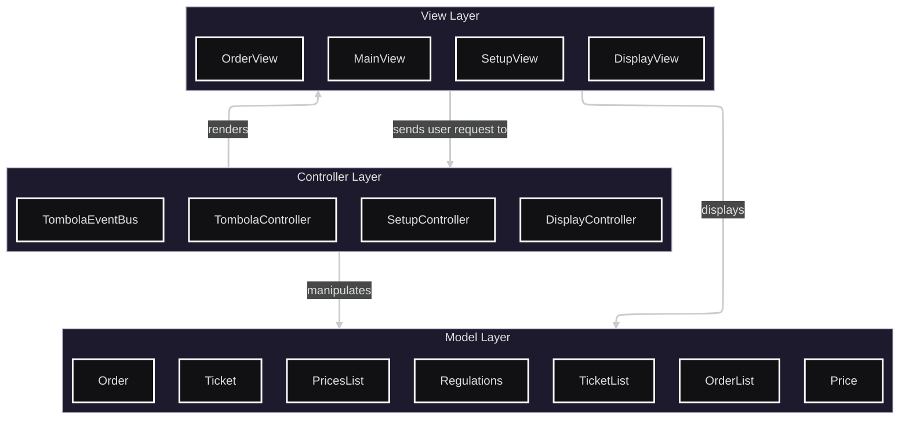

# Code Desing
This read-me shows architecture and design of Tombola Organizer.

## Overview
This short overview explains the concept Tombola Organzier. The relations of different topics is shown.

## Domain Model
The domain model is usefull for programmers to understand classes and their functionality. 

## Design
The desing decision is based on the MVC-Pattern.

